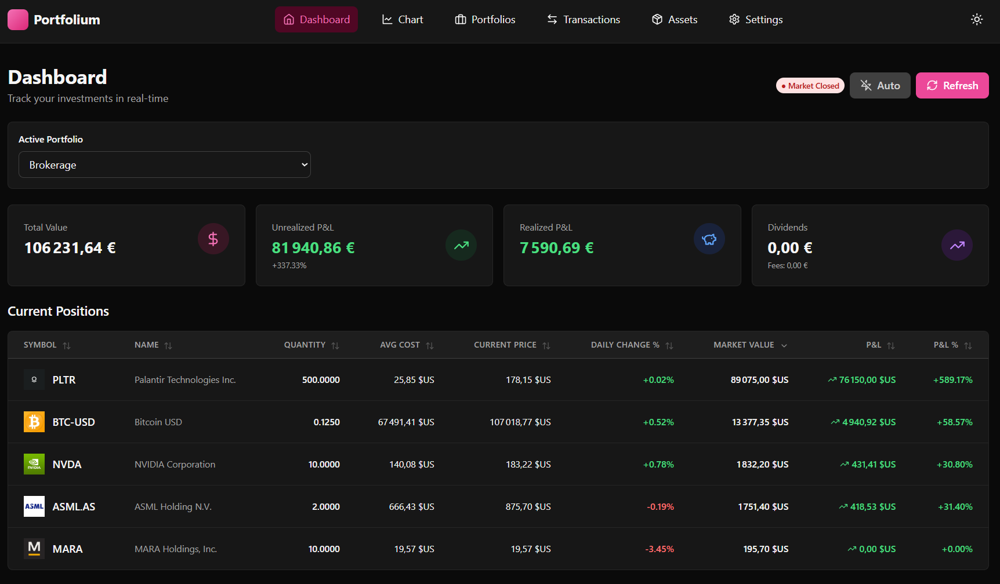
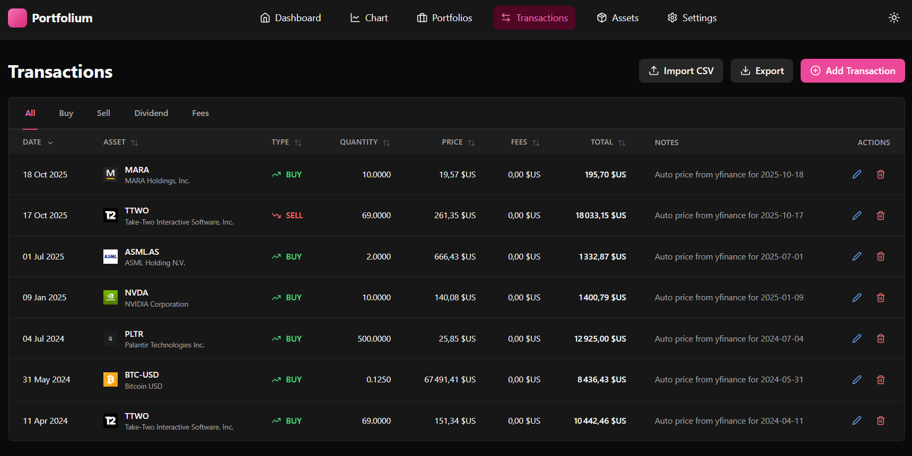
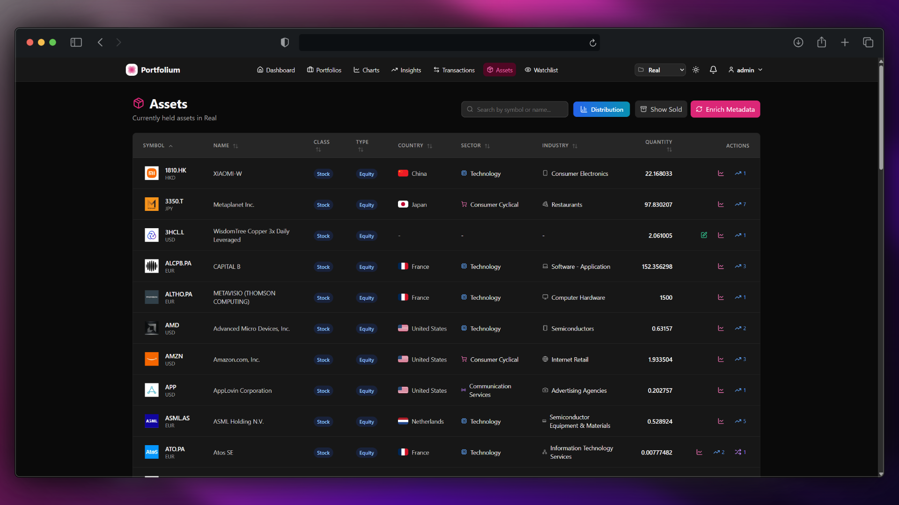

<div class="wip" style="border: 2px solid #ffcc00; padding: 15px; margin-bottom: 25px; text-align: center; background-color: #fff8e1; border-radius: 8px;">
  <strong style="color: #ff5722;">Work in Progress:</strong> This project is currently under active development. Features and functionality may change frequently. Please check back often for updates!
</div>

<div align="center">

# 🌸 Portfolium

**Investment tracking application** with multi-asset portfolio management (stocks, ETFs, crypto), P&L calculations, CSV import, real-time price updates, automatic logo fetching, ticker search, and modern UI.

---

### 📸 Screenshots

<p align="center">
  
  <br/>
  <em>Dashboard with real-time metrics and portfolio overview</em>
</p>

<p align="center">
  
  <br/>
  
  <em>Transaction history & Asset management with logos</em>
</p>

</div>

## 🏗️ Architecture

Monorepo with 3 services:

- **db**: PostgreSQL 15
- **api**: FastAPI (Python 3.11) + yfinance
- **web**: React + Vite + TypeScript + TailwindCSS + shadcn/ui

## 🚀 Quick Start

### Prerequisites

- Docker & Docker Compose
- (Optional) Node.js 18+ and Python 3.11+ for local development

### Launch

```bash
# Copy environment variables (edit as needed)
cp .env.example .env

# Start all services
docker compose up -d

# View logs
docker compose logs -f

# Check API health
curl http://localhost:8000/health

# Access the frontend
# Open http://localhost:5173
```

Services are available at:

- **Frontend**: http://localhost:5173
- **API**: http://localhost:8000
- **API Docs**: http://localhost:8000/docs
- **PostgreSQL**: localhost:5432

### Shutdown

```bash
docker compose down

# With volume removal (⚠️ deletes all data)
docker compose down -v
```

## 🎯 Features

### Backend API

- ✅ Multi-portfolio management
- ✅ Support for stocks, ETFs, crypto (via Yahoo Finance tickers)
- ✅ Transactions: BUY, SELL, DIVIDEND, FEE, SPLIT
- ✅ Automatic average cost calculation (weighted average)
- ✅ Realized and unrealized P&L
- ✅ CSV import
- ✅ Price refresh via yfinance (on-demand + scheduler)
- ✅ Price caching (configurable TTL)
- ✅ Sell validation (prevents selling more shares than owned - configurable)
- ✅ Unit tests (pytest)

### Frontend

- ✅ Dashboard with real-time metrics
- ✅ Logos via Brandfetch API
- ✅ Ticker auto-completion & search via Yahoo Finance
- ✅ Positions table (sorting, filters, pagination)
- ✅ Transaction history
- ✅ CSV import with drag & drop
- ✅ Dark mode
- ✅ Price charts (Recharts)
- ✅ Responsive UI

## 📊 Database

### Schema

**4 main tables** in the `portfolio` schema:

1. **assets**: List of assets (unique Yahoo ticker)
2. **portfolios**: User portfolios
3. **transactions**: Operation history
4. **prices**: Latest prices cache

## 🔧 API Endpoints

### Health

- `GET /health` → API status

### Assets

- `GET /assets` → List assets (with optional `query`, `skip`, `limit`)
- `GET /assets/{asset_id}` → Get asset by id
- `POST /assets` → Create an asset
- `PUT /assets/{asset_id}` → Update an asset
- `DELETE /assets/{asset_id}` → Delete an asset
- `GET /assets/search_ticker?query=AAPL` → Yahoo Finance search
- `GET /assets/held/all` → Currently held assets across portfolios
- `GET /assets/sold/all` → Previously held (now zero) assets
- `POST /assets/enrich/all` → Enrich metadata for all assets
- `POST /assets/enrich/{asset_id}` → Enrich metadata for one asset

### Portfolios

- `GET /portfolios` → List current user's portfolios
- `POST /portfolios` → Create new portfolio
- `GET /portfolios/{id}` → Get a portfolio
- `PUT /portfolios/{id}` → Update a portfolio
- `DELETE /portfolios/{id}` → Delete a portfolio
- `GET /portfolios/{id}/positions` → Positions with P&L
- `GET /portfolios/{id}/metrics` → Aggregated metrics
- `GET /portfolios/{id}/history` → Portfolio value history
- `GET /portfolios/{id}/transactions` → Transaction list (filters: asset_id, type, date_from, date_to)

### Transactions

- `POST /portfolios/{id}/transactions` → New transaction
- `GET /portfolios/{id}/transactions/{tx_id}` → Get a transaction
- `PUT /portfolios/{id}/transactions/{tx_id}` → Update a transaction
- `DELETE /portfolios/{id}/transactions/{tx_id}` → Delete a transaction
- `POST /portfolios/{id}/add_position_transaction` → Add BUY/SELL with yfinance price for a date
- `POST /import/csv?portfolio_id={id}` → CSV import

### Prices

- `GET /prices?symbols=AAPL,MSFT` → Current prices
- `POST /prices/refresh?portfolio_id={id}` → Force refresh portfolio prices

### Settings

- `GET /settings` → Get settings
- `PUT /settings` → Update settings

### Authentication

- `POST /auth/register` → Register
- `POST /auth/login` → Login (OAuth2 password flow)
- `GET /auth/me` → Current user info
- `PUT /auth/me` → Update profile (email change triggers re-verification)
- `POST /auth/verify-email` → Verify email with token
- `POST /auth/resend-verification` → Resend verification email
- `POST /auth/forgot-password` → Request password reset
- `POST /auth/reset-password` → Reset password with token
- `POST /auth/change-password` → Change password (auth)
- `DELETE /auth/account` → Delete own account

### Admin

- `DELETE /admin/data` → Danger: delete all portfolios, assets, transactions, prices
- `GET /admin/users` → List users
- `POST /admin/users` → Create user
- `PATCH /admin/users/{id}` → Update user (status/admin/email/username/password)
- `DELETE /admin/users/{id}` → Delete user

### Logs

- `GET /logs` → Query API logs (filters: level, search, page, page_size)

Interactive documentation: http://localhost:8000/docs

## 📥 CSV Import Format

Supported columns:

```csv
date,symbol,type,quantity,price,fees,currency,notes
2024-01-15,AAPL,BUY,10,150.25,9.99,USD,Initial purchase
2024-02-20,AAPL,BUY,5,165.80,9.99,USD,Adding to position
2024-03-10,AAPL,DIVIDEND,15,0.24,0,USD,Q1 dividend
2024-04-05,AAPL,SELL,5,180.50,9.99,USD,Taking profits
2024-05-15,NVDA,BUY,20,520.30,15.99,USD,AI boom position
2024-06-20,MSFT,BUY,8,375.20,9.99,USD,Cloud diversification
```

Accepted types: `BUY`, `SELL`, `DIVIDEND`, `FEE`, `SPLIT`

For a **split** (e.g., 2:1), add a `split_ratio` column:

```csv
date,symbol,type,split_ratio
2024-06-01,AAPL,SPLIT,2:1
```

## 🧪 Tests

### Backend

```bash
# Inside the container
docker compose exec api pytest

# Locally
cd api
python -m pytest tests/ -v
```

### Coverage

- Tests for average cost and P&L calculations
- Tests for pricing service (with yfinance mocking)
- CSV import tests

## 🛠️ Local Development

### API (without Docker)

```bash
cd api
python -m venv venv
source venv/bin/activate  # Windows: venv\Scripts\activate
pip install -e .
uvicorn app.main:app --reload --port 8000
```

### Frontend (without Docker)

```bash
cd web
npm install
npm run dev
```

## 🔒 Security

- CORS configured for development origins: see `CORS_ORIGINS`
- Pydantic validation on all inputs
- JWT-based auth (Bearer token) for user endpoints
- Role checks: admin endpoints require `is_admin` or `is_superuser`
- Emails are optional; verification flow supported when SMTP configured
- Logs accessible via `/logs` endpoint for debugging
- Docker healthchecks

## ⚙️ Advanced Configuration

### Environment Variables

Environment variables (subset; see `.env.example` for full list):

- Database
  - `POSTGRES_DB` (default: portfolium)
  - `POSTGRES_USER` (default: portfolium)
  - `POSTGRES_PASSWORD` (default: portfolium)
  - `POSTGRES_HOST` (default: db)
  - `POSTGRES_PORT` (default: 5432)

- API
  - `API_HOST` (default: 0.0.0.0)
  - `API_PORT` (default: 8000)
  - `SECRET_KEY` (JWT signing key)
  - `ALGORITHM` (default: HS256)
  - `ACCESS_TOKEN_EXPIRE_MINUTES` (default: 10080 = 7 days)
  - `CORS_ORIGINS` (comma separated; default includes http://localhost:5173)
  - `API_KEY` (not required by default; reserved)

- Pricing & Validation
  - `PRICE_CACHE_TTL_SECONDS` (default: 300)
  - `VALIDATE_SELL_QUANTITY` (default: true)

- Admin bootstrap
  - `ADMIN_AUTO_CREATE` (default: true)
  - `ADMIN_EMAIL`, `ADMIN_USERNAME`, `ADMIN_PASSWORD` (required to create)
  - `ADMIN_FULL_NAME` (optional)
  - `ADMIN_IS_ACTIVE` (default: true)
  - `ADMIN_IS_VERIFIED` (default: true)

- Email (optional)
  - `ENABLE_EMAIL` (default: false)
  - `SMTP_HOST`, `SMTP_PORT`, `SMTP_USER`, `SMTP_PASSWORD`, `SMTP_TLS`
  - `FROM_EMAIL`, `FROM_NAME`
  - `FRONTEND_URL` (links in emails; default: http://localhost:5173)

- Logos
  - `BRANDFETCH_API_KEY` (optional)

### Transaction Validation

Automatic validation that prevents selling more shares than owned.

```bash
# In .env
VALIDATE_SELL_QUANTITY=true  # Default: true
```

To disable (useful for importing historical data or short selling):

```bash
VALIDATE_SELL_QUANTITY=false
```

### Price Scheduler

By default, automatic refresh every **15 minutes** for portfolio assets.

Configurable in `api/app/tasks/scheduler.py`.

### Cache TTL

`PRICE_CACHE_TTL_SECONDS=300` (5 minutes by default)

### Brandfetch API (Logo Fetching)

The application can automatically fetch company logos using the Brandfetch API.

```bash
# In .env
BRANDFETCH_API_KEY=your_api_key_here
```

To get an API key:
1. Visit [Brandfetch](https://brandfetch.com/)
2. Sign up for a free account
3. Get your API key from the dashboard

**Note**: Logo fetching is optional. If no API key is provided, the feature will be disabled automatically.

## 👥 Multi-users & Authentication

Portfolium supports multiple users with JWT authentication and optional email verification.

- Registration creates an inactive/unverified user until the email is verified (when email is enabled).
- Users manage their own profiles and portfolios; every portfolio belongs to a specific user.
- Authorization is enforced per-portfolio: users may only access their own portfolios and transactions.
- Admins can manage any user and perform maintenance actions.

Auth details:
- OAuth2 password flow at `/auth/login` returns a bearer token.
- Include `Authorization: Bearer <token>` on protected endpoints.
- Email verification and password reset flows are available when SMTP is configured.

## 🧑‍💼 Administration

Admin users (is_admin or is_superuser) have access to:

- User management: list, create, update, delete (`/admin/users`)
- Data maintenance: truncate all portfolio data (`DELETE /admin/data`)

Bootstrap an admin on startup by setting env vars:

```
ADMIN_AUTO_CREATE=true
ADMIN_EMAIL=admin@example.com
ADMIN_USERNAME=admin
ADMIN_PASSWORD=change_me
ADMIN_FULL_NAME=Site Admin
ADMIN_IS_ACTIVE=true
ADMIN_IS_VERIFIED=true
```

The first admin (or the account matching `ADMIN_EMAIL`) is protected from accidental deactivation, admin revocation, or deletion.

## 🐛 Troubleshooting

### API won't start

```bash
docker compose logs api
# Check that PostgreSQL is ready
docker compose ps
```

### Prices not refreshing

- Check scheduler logs: `docker compose logs api | grep scheduler`
- Yahoo Finance may rate-limit: the service uses a fallback to the last prices in DB

### CORS Error

Verify that `VITE_API_URL` points to `http://localhost:8000` in `.env`.

## 📄 License

MIT

---