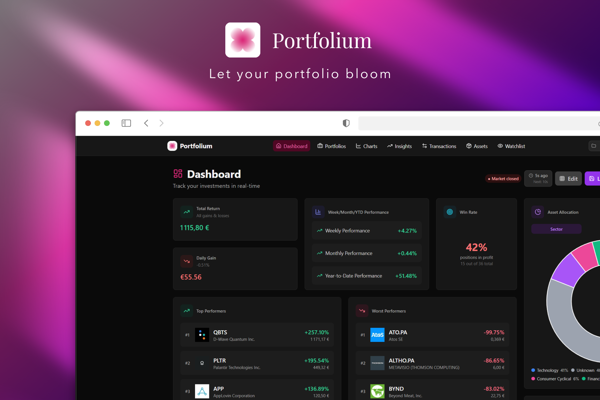
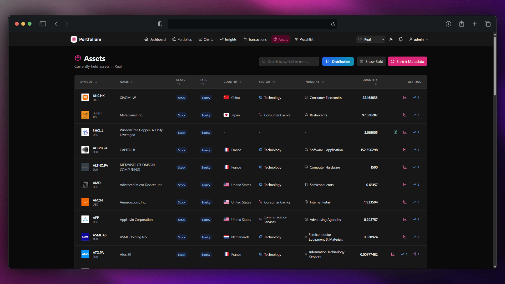

<div align="center">


Open source • Self-hosted • Privacy-first

<br/>

# 🌸 Portfolium

### Let your portfolio bloom

**Track stocks, ETFs, and crypto with real-time pricing, P&L analytics, and beautiful charts.**  

<br/>

<!-- Badges -->
[](https://github.com/ArthurMTX/Portfolium/releases)
[](LICENSE)
[](https://hub.docker.com/r/arthurmtx/portfolium-api)

[](https://www.python.org/)
[](https://fastapi.tiangolo.com/)
[](https://react.dev/)
[](https://www.typescriptlang.org/)

<br/>

[🚀 Quick Start](#-quick-start) • [✨ Features](#-features) • [📚 Documentation](docs/) • [🐳 Docker Hub](https://hub.docker.com/r/arthurmtx/portfolium-api)

---

<br/>

## 🖼️ Demo

<div align="center">
  
  <span>Dashboard, transactions, insights, watchlist, and much more!</span>
</div>

👉 More screenshots in the [Gallery](docs/user-guide/gallery.md).

</div>

<br/>

<div align="center">

## 🚀 Quick Start

**Get Portfolium running in under 2 minutes**

</div>

### 🐳 Production Deployment (Recommended)

> **One-command deployment**, just pull and run!

```bash
# Download and deploy
mkdir portfolium && cd portfolium
curl -O https://raw.githubusercontent.com/ArthurMTX/Portfolium/main/docker-compose.yml
curl -O https://raw.githubusercontent.com/ArthurMTX/Portfolium/main/.env.example
cp .env.example .env

# Configure your settings
nano .env

# 🚀 Launch!
docker compose pull && docker compose up -d
```

| Service | URL | Description |
|---------|-----|-------------|
| 🌐 Web App | `http://localhost:80` | Main application |
| 📖 API Docs | `http://localhost:8000/docs` | Swagger UI |
| 🌸 Flower | `http://localhost:5555` | Task monitoring |

---

### 💻 Development Setup

> **Prerequisites:** [Docker](https://docker.com) & [Docker Compose](https://docs.docker.com/compose/)

```bash
# Clone the repository
git clone https://github.com/ArthurMTX/Portfolium.git
cd Portfolium

# Configure environment
cp .env.example .env

# Start development environment
docker compose -f ./docker-compose.dev.yml up -d --build
```

| Service | URL | Description |
|---------|-----|-------------|
| 🌐 Frontend (HMR) | `http://localhost:5173` | Vite dev server |
| 📖 API Docs | `http://localhost:8000/docs` | Swagger UI |
| 🌸 Flower | `http://localhost:5555` | Task monitoring |

✨ **That's it!** Default admin credentials are in your `.env` file, and local MiniLM theme classification works without a Gemini API key.

<details>
<summary> <strong>Manual setup without Docker</strong></summary>

```bash
# Backend
cd api
python -m venv venv
source venv/bin/activate  # Windows: venv\Scripts\activate
pip install -e .
uvicorn app.main:app --reload

# Frontend
cd web
npm install
npm run dev
```
</details>

---

<br/>

<div align="center">

## 🏗️ Tech Stack

**Built with modern, battle-tested technologies**

</div>

<br/>

<table align="center">
  <tr>
    <td align="center" width="96">
      
      <br>Python
    </td>
    <td align="center" width="96">
      
      <br>FastAPI
    </td>
    <td align="center" width="96">
      
      <br>React
    </td>
    <td align="center" width="96">
      
      <br>TypeScript
    </td>
    <td align="center" width="96">
      
      <br>PostgreSQL
    </td>
  </tr>
  <tr>
    <td align="center" width="96">
      
      <br>Redis
    </td>
    <td align="center" width="96">
      
      <br>Docker
    </td>
    <td align="center" width="96">
      
      <br>Vite
    </td>
    <td align="center" width="96">
      
      <br>Tailwind
    </td>
    <td align="center" width="96">
      
      <br>Nginx
    </td>
  </tr>
  <tr>
    <td align="center" width="96">
      
      <br>Celery
    </td>
    <td align="center" width="96">
      
      <br>SQLAlchemy
    </td>
    <td align="center" width="96">
      
      <br>Pydantic
    </td>
    <td align="center" width="96">
      
      <br>Chart.js
    </td>
    <td align="center" width="96">
      
      <br>MkDocs
    </td>
  </tr>
</table>

<br/>

<div align="center">

**Data Providers & APIs**

</div>

<table align="center">
  <tr>
    <td align="center" width="96">
      
      <br>Yahoo Finance
    </td>
    <td align="center" width="96">
      
      <br>Brandfetch
    </td>
    <td align="center" width="96">
      
      <br>CNN
    </td>
    <td align="center" width="96">
      
      <br>alternative.me
    </td>
    <td align="center" width="96">
      
      <br>Flagpedia
    </td>
  </tr>
</table>

<br/>

<details>
<summary>📦 <strong>Full Architecture & Providers Details</strong></summary>

<br/>

| Component | Technology | Description |
|-----------|------------|-------------|
| **Database** | PostgreSQL 15 | Primary data store |
| **Cache** | Redis 7 | Caching & message broker |
| **API** | FastAPI + SQLAlchemy | REST API with yfinance integration |
| **Worker** | Celery (4 threads) | Background task processing |
| **Scheduler** | Celery Beat | Scheduled task orchestration |
| **Monitor** | Flower | Real-time task monitoring |
| **Frontend** | React 18 + Vite | Modern SPA with shadcn/ui |
| **Styling** | TailwindCSS | Utility-first CSS |
| **Web Server** | Nginx | Reverse proxy & static file serving |
| **Containerization** | Docker | Environment isolation & deployment |
| **Documentation** | MkDocs + Swagger | User & API docs |

| Data Provider | Purpose |
|---------------|---------|
| **Yahoo Finance** | Real-time pricing & historical data |
| **Brandfetch** | Company logos & branding |
| **CNN** | Market sentiment |
| **alternative.me** | Crypto market sentiment |
| **Flagpedia.net** | Country flags for currency assets |

</details>

---

<br/>

<div align="center">

## ✨ Features

</div>

<br/>

<table>
  <tr>
    <td width="50%">
      <h3>📈 Portfolio Management</h3>
      <ul>
        <li>Multi-portfolio support with user isolation</li>
        <li>Stocks, ETFs, crypto (Yahoo Finance)</li>
        <li>Currency support with real-time rates</li>
        <li>Automatic cost basis & P&L calculations</li>
        <li>Realized/unrealized gains tracking</li>
        <li>Transaction import with CSV validation</li>
        <li>Watchlist with alerts and tags</li>
      </ul>
    </td>
    <td width="50%">
      <h3>🎨 Modern UI</h3>
      <ul>
        <li>Clean, responsive design</li>
        <li>Widgets and customizable dashboards</li>
        <li>Dark/Light mode toggle</li>
        <li>Real-time charts & heatmaps</li>
        <li>Company logo integration</li>
        <li>Ticker search & autocomplete</li>
        <li>Mobile-friendly layout</li>
        <li>Accessibility compliant</li>
        <li>Multi-language support (i18n)</li>
        <li>Documentation with MkDocs</li>
      </ul>
    </td>
  </tr>
  <tr>
    <td width="50%">
      <h3>🔧 Developer Experience</h3>
      <ul>
        <li>FastAPI with auto-generated docs</li>
        <li>JWT authentication & RBAC</li>
        <li>Comprehensive test coverage</li>
        <li>Hot reload for development</li>
        <li>Type-safe with TypeScript</li>
      </ul>
    </td>
    <td width="50%">
      <h3>🌐 Production Ready</h3>
      <ul>
        <li>Docker containerized</li>
        <li>Redis caching layer</li>
        <li>Celery background tasks</li>
        <li>Email notifications (optional)</li>
        <li>Admin dashboard & monitoring</li>
      </ul>
    </td>
  </tr>
</table>

---

<br/>

<div align="center">

## 📚 Documentation

**Everything you need to get started and beyond**

</div>

<br/>

<div align="center">

| | Resource | Description |
|:-:|----------|-------------|
| 🚀 | **[Quick Start](docs/getting-started/quick-start.md)** | Get up and running in minutes |
| 📖 | **[API Reference](docs/api/overview.md)** | Complete endpoint documentation |
| 📘 | **[User Guide](docs/user-guide/dashboard.md)** | Feature walkthrough |
| ⚙️ | **[Configuration](docs/getting-started/configuration.md)** | Environment variables & settings |
| 🛠️ | **[Technical Docs](docs/technical/overview.md)** | Architecture & internals |

</div>

---

<br/>

<div align="center">

## 🔐 Security

</div>

<br/>

<div align="center">

| Feature | Implementation |
|---------|----------------|
| 🔑 Authentication | JWT tokens with bcrypt password hashing |
| 🛡️ Authorization | Role-based access control (user/admin) |
| 🌐 CORS | Configurable trusted origins |
| 🗃️ SQL Injection | Prevention via SQLAlchemy ORM |
| ✅ Validation | Input sanitization with Pydantic |
| 📧 Email | Optional verification flow |

</div>

---

<br/>

<div align="center">

## 🤝 Contributing

**I welcome contributions from the community!**

Please read our **[Contributing Guide](docs/development/contributing.md)** to get started.

<br/>

[](https://github.com/ArthurMTX/Portfolium/issues)
[](https://github.com/ArthurMTX/Portfolium/pulls)

</div>

---

<br/>

<div align="center">

## 📄 License

This project is licensed under the **MIT License**, see the [LICENSE](LICENSE) file for details.

<br/>

---

<br/>

### ⭐ Star History

[](https://star-history.com/#ArthurMTX/Portfolium&Date)

<br/>

---

<br/>

**Made with ❤️ by [ArthurMTX](https://github.com/ArthurMTX)**

<br/>

<a href="https://github.com/ArthurMTX/Portfolium/issues/new?template=bug_report.md">
  
</a>
<a href="https://github.com/ArthurMTX/Portfolium/issues/new?template=feature_request.md">
  
</a>

<br/>
<br/>

**If you found this project useful, please consider giving it a ⭐!**

</div>
