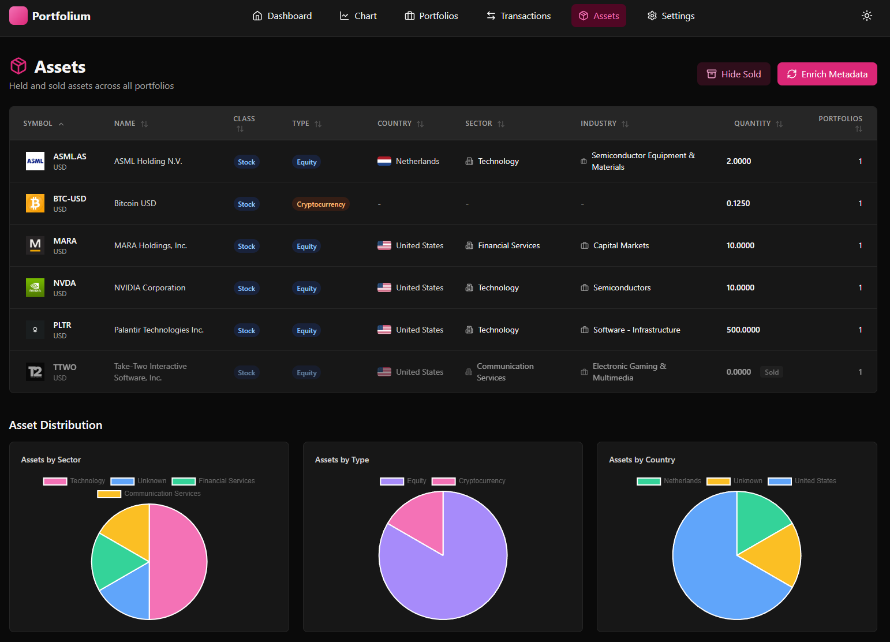

<div align="center">

#  Portfolium

**Modern investment portfolio tracker**  Manage stocks, ETFs, and crypto with real-time pricing, P&L analytics, and beautiful charts.

[](LICENSE)
[](https://www.python.org/downloads/)
[](https://fastapi.tiangolo.com/)
[](https://react.dev/)

[Quick Start](#-quick-start)  [Features](#-features)  [Documentation](docs/)  [API Docs](http://localhost:8000/docs)

---

###  Screenshots

<p align="center">
  
  <br/>
  <em>Real-time dashboard with portfolio metrics and performance tracking</em>
</p>

<p align="center">
  
  <br/>
  
  <em>Transaction history & Asset management with logos</em>
</p>

</div>

---

## 🚀 Quick Start

### Production Deployment

Just download the docker-compose file and deploy:

```bash
# 1. Download files
mkdir portfolium && cd portfolium
curl -O https://raw.githubusercontent.com/ArthurMTX/Portfolium/main/docker-compose.yml
curl -O https://raw.githubusercontent.com/ArthurMTX/Portfolium/main/.env.example
cp .env.example .env

# 2. Configure (edit .env with your settings)
nano .env

# 3. Deploy
docker compose -f docker-compose.yml pull
docker compose -f docker-compose.yml up -d

# 4. Update anytime
docker compose -f docker-compose.yml pull
docker compose -f docker-compose.yml up -d --force-recreate
```

### Development Setup

**Prerequisites:** Docker & Docker Compose

```bash
# 1. Clone and configure
git clone https://github.com/ArthurMTX/Portfolium.git
cd Portfolium
cp .env.example .env

# 2. Launch
docker compose up -d

# 3. Access
# Frontend: http://localhost:5173
# API Docs: http://localhost:8000/docs
```

That's it!  Default admin credentials are in your `.env` file.

<details>
<summary> <strong>Manual setup without Docker</strong></summary>

```bash
# Backend
cd api
python -m venv venv
source venv/bin/activate  # Windows: venv\Scripts\activate
pip install -e .
uvicorn app.main:app --reload

# Frontend
cd web
npm install
npm run dev
```
</details>

---

## 🏗️ Architecture & Tech Stack

**Monorepo Structure:**
- **db**: PostgreSQL 15
- **api**: FastAPI (Python 3.11) + yfinance + SQLAlchemy
- **web**: React 18 + TypeScript + Vite + TailwindCSS + shadcn/ui

**DevOps:** Docker • Docker Compose • GitHub Actions • Docker Hub

## ✨ Features

### 📈 Portfolio Management
- Multi-portfolio support with user isolation
- Stocks, ETFs, crypto (Yahoo Finance)
- Automatic cost basis & P&L calculations
- Realized/unrealized gains tracking
- CSV import with drag & drop

### 🎨 Modern UI
- Clean, responsive design
- Dark mode
- Real-time charts & heatmaps
- Company logo integration
- Ticker search & autocomplete
- Price alerts & notifications

### 🔧 Developer Experience
- FastAPI with auto-generated docs
- JWT authentication
- Role-based access control
- Comprehensive test coverage
- Hot reload for development

### 🌐 Production Ready
- Docker containerized
- PostgreSQL backend
- Automatic price updates
- Currency conversion
- Email notifications (optional)
- Admin dashboard

---

## 📚 Documentation

Comprehensive documentation is available in the [`docs/`](docs/) folder:

- **[Quick Start Guide](docs/getting-started/quick-start.md)**  Get up and running
- **[API Reference](docs/api/overview.md)**  Complete endpoint documentation
- **[User Guide](docs/user-guide/dashboard.md)**  Feature walkthrough
- **[Technical Docs](docs/technical/overview.md)**  Architecture & internals
- **[Configuration](docs/getting-started/configuration.md)**  Environment variables & settings

---

## 🔐 Security

- JWT-based authentication with bcrypt password hashing
- Role-based authorization (user/admin)
- CORS configuration for trusted origins
- SQL injection prevention via SQLAlchemy ORM
- Input validation with Pydantic
- Optional email verification flow

---

## 🤝 Contributing

Contributions welcome! See [`docs/development/contributing.md`](docs/development/contributing.md) for guidelines.

---

## 📄 License

MIT  [Arthur MTX](https://github.com/ArthurMTX)

---

<div align="center">

**Built with  using FastAPI and React**

[Report Bug](https://github.com/ArthurMTX/Portfolium/issues)  [Request Feature](https://github.com/ArthurMTX/Portfolium/issues)

</div>
